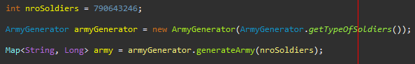
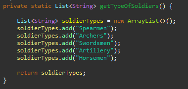
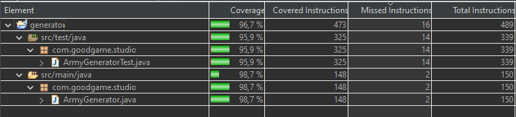

# army-api

API to generate an army with random distribution of soldier types

## Description
The generator offers a **generateArmy()** method which expects a number to determine the size of the army. 



The type of soldiers of the army is configured in the **getTypeOfSoldiers()** method. This method could load and fill this list from differente sources *(database, text file, rest
	 endpoint, etc)*



The type of soldiers distribution is obtained randomly but meeting the request number of soldiers (On every execution the type of soldiers distribution is randomly generated even if you call the generator multiple times with the same request number of soldiers). 


The generator always generate at least one type of each soldier unless the requested number of soldiers is less than the type of soldiers configured.


## Execute the Client

The client emulate the consumption of the api. You can called using this maven command.

```
mvn compile -pl client exec:java -Dexec.arguments=NUMBER_OR_SOLDIERS
```
**NUMBER_OR_SOLDIERS**: Integer number or soldiers you want.

if not number is specified, it would request a random number of soldiers
```
mvn compile -pl client exec:java
```


## Code Coverage



## Algorithm  Complexity

- **Time Complexity:** *O(1)* The algorithm doesn´t depend on the request number of soldiers (input) for the generation.
- **Space Complexity:** *O(n)* The algorithm create a map which size is dictated by the request number of soldiers (input).


