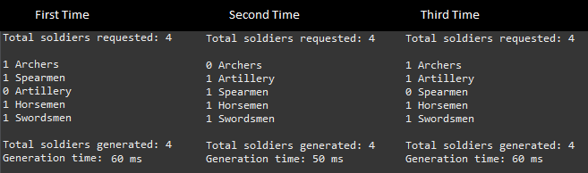
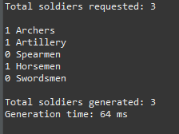
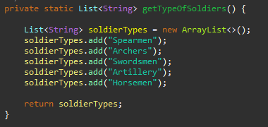
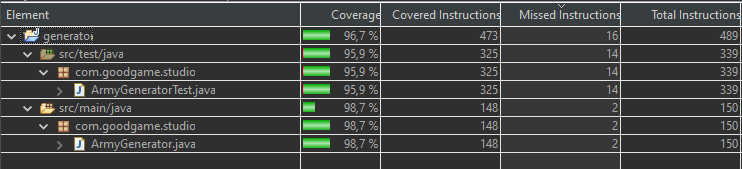

# army-api

API to generate an army with random distribution of soldiers types

## Description
The generator has one class called **ArmyGenerator** which offers a public method called **generateArmy()** which expects the number of desired soldiers to generate the army.
The type of soldiers of the army is configured by a list passed in the constructor of the class. 


The type of soldiers distribution is obtained randomly but meeting the request number of soldiers. On every execution the type of soldiers distribution is randomly generated even if you call the generator multiple times with the same request number of soldiers. 



The generator always generate at least one type of each soldier unless the requested number of soldiers is less than the type of soldiers configured.



## Execute the Client

The client emulate the consumption of the api. The helper method getTypeOfSoldiers() generate the list of type of soldiers. This method could load and fill this list from differente sources *(database, text file, rest endpoint, etc)* as needed, for this example it has a hardcode list.



You can called using the following maven command (**NUMBER_OR_SOLDIERS**: Integer number or soldiers you want).

```
mvn compile -pl client exec:java -Dexec.arguments=NUMBER_OR_SOLDIERS
```
if not number is specified, it would request a random number of soldiers
```
mvn compile -pl client exec:java
```

## Code Coverage



## Algorithm  Complexity

- **Time Complexity:** *O(1)* The algorithm doesn´t depend on the request number of soldiers (input) for the generation.
- **Space Complexity:** *O(n)* The algorithm create a map which size is dictated by the request number of soldiers (input).


